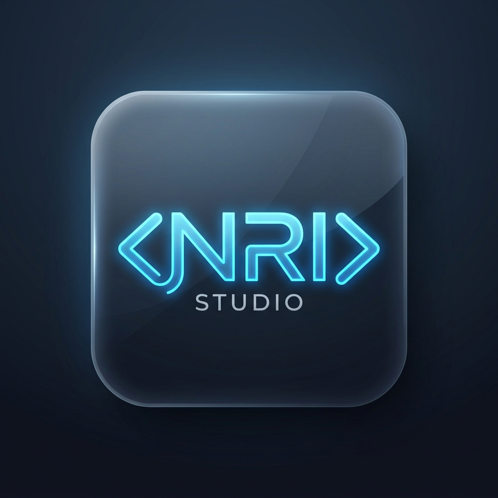

<div align="center">
  
  <h1>NRI Studio</h1>
  <p><strong>A Modern, Cloud-Based VSCode-Style Web IDE</strong></p>
</div>

---

## 🚀 Overview
**NRI Studio** is a full-stack, browser-based Integrated Development Environment (IDE) that closely mimics the behavior and UI of VSCode. Built for modern web development, it allows users to create, edit, save, and execute JavaScript and TypeScript code entirely in the cloud.

## ✨ Features
- **VSCode-like UI**: Dark theme, collapsible sidebar, multi-tab support, and a dedicated status bar.
- **Monaco Editor Integration**: Full IntelliSense, syntax highlighting, code auto-completion, and live error checking.
- **Single Workspace Explorer**: Dedicated project view with "Open Editors" and "Project Files" accordions.
- **Local Folder Upload**: Seamlessly import your local projects into the cloud workspace.
- **Live Terminal & Sandbox Execution**: Run JS/TS code directly in the browser via a secure Node.js backend sandbox.
- **Real-Time Auto-Save**: Never lose your progress. Code is auto-saved to MongoDB seamlessly.
- **Firebase Authentication**: Secure email/password and Google login.

## 🛠️ Technology Stack
- **Frontend**: React 18, TypeScript, Vite, Zustand, Monaco Editor, Xterm.js
- **Backend**: Node.js, Express, TypeScript, Zod, Helmet, Cors
- **Database**: MongoDB (Mongoose)
- **Authentication**: Firebase Auth & Admin SDK

---

## 💻 Local Development

### 1. Clone the repository
```bash
git clone https://github.com/Rotananob/NRI-Studio.git
cd NRI-Studio
```

### 2. Setup Environment Variables
- In the `backend/` folder, create a `.env` file containing your `MONGODB_URI` and Firebase credentials.
- In the `frontend/` folder, create a `.env` file containing your `VITE_FIREBASE_*` config.

### 3. Run the Backend
```bash
cd backend
npm install
npm run dev
```

### 4. Run the Frontend
```bash
cd frontend
npm install
npm run dev
```

---

## 🚀 Deployment Guide

NRI Studio is configured for 1-click deployment!

### 1. Backend (Render)
We have provided a `render.yaml` file at the root.
1. Go to [Render.com](https://render.com)
2. Click **New +** > **Blueprint**
3. Connect this GitHub repository.
4. Render will automatically detect the `render.yaml` and deploy the Node.js API.
5. *Don't forget to add your MongoDB and Firebase environment variables in the Render Dashboard!*

**Backend Live URL:** `https://your-backend-url.onrender.com`

### 2. Frontend (Vercel)
We have provided a `vercel.json` file in the `frontend` folder.
1. Go to [Vercel.com](https://vercel.com)
2. Click **Add New** > **Project**
3. Connect this GitHub repository.
4. Set the **Framework Preset** to `Vite`.
5. Set the **Root Directory** to `frontend`.
6. Add your Firebase Environment Variables.
7. Click **Deploy**.

**Frontend Live URL:** `https://nri-studio.vercel.app` (Example)

> **Important:** Once you deploy the backend, make sure to update the `VITE_API_URL` in your Vercel frontend settings to point to your new Render Backend URL!

---
*Developed with ❤️ by Nob Rothana*
